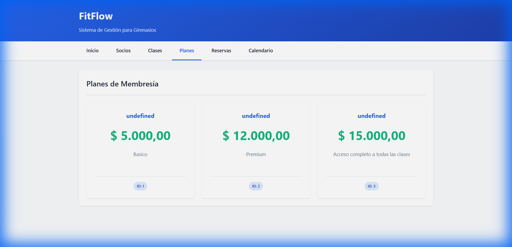
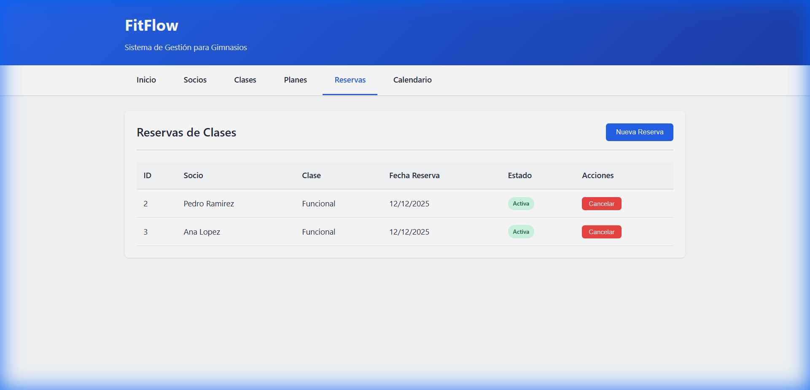

# 🏋️ Tour de FitFlow - Sistema de Gestión de Gimnasio

FitFlow es un sistema open-source diseñado para la gestión integral de operaciones de gimnasios, desarrollado como Trabajo Práctico Anual de Diseño de Sistemas de Software I (2025).

---

## 🎬 Video Demo


---

## 📋 Cumplimiento de Entregas

### ✅ Entrega 1: Arquitectura y Modelado - Parte I

| Requerimiento | Implementación |
|---------------|----------------|
| Crear Plan de Membresía | `src/services/plan_service.py` |
| Importar socios desde CSV | `src/services/csv_importer_service.py` (pandas) |
| Navegar clases de un Plan | `src/api/controllers/clase_controller.py` |
| Filtrar clases por horario/día | `src/services/clase_service.py` |
| Solicitar baja (mín. 150 chars) | `src/services/solicitud_baja_service.py` |
| Aprobar/rechazar solicitudes | `src/api/controllers/solicitud_baja_controller.py` |

---

### ✅ Entrega 2: Arquitectura y Modelado - Parte II

| Requerimiento | Implementación |
|---------------|----------------|
| Reservar cupo en clase | `src/services/reserva_service.py` (validaciones: socio activo, plan válido, cupo) |
| Actualizar pagos diariamente | `src/datasources/proxy/pasarela_pagos_proxy.py` (tarea programada) |
| Ver talleres externos en calendario | `src/datasources/proxy/clases_externas_proxy.py` (API REST externa) |
| Rechazo automático de solicitudes | `src/validators/solicitud_validator.py` (**Strategy Pattern**) |

**Concepto técnico:** Las **Fuentes Proxy** actúan como intermediarios con servicios externos (pasarela de pagos ficticia, API de talleres).

---

### ✅ Entrega 3: Integración y Modelado - Parte III

| Requerimiento | Implementación |
|---------------|----------------|
| Elegir modo visualización (Normal/Ocupado) | `src/services/agregador_horarios_service.py` |
| Lista de espera en clases | `src/services/lista_espera_service.py` (notificación + confirmación 24hs) |
| Modificar clases de un plan | `src/api/controllers/plan_controller.py` (agregar/quitar clases) |
| API REST administrativa y pública | `src/api/controllers/*.py` |

**Concepto técnico:** El **Servicio Agregador** consolida clases internas (BD local) + talleres externos (API) en un calendario unificado. Se actualiza cada hora vía APScheduler.

---

### ✅ Entrega 4: Persistencia

| Requerimiento | Implementación |
|---------------|----------------|
| Persistir entidades con ORM | SQLAlchemy (`src/models/*.py`) - SQLite/PostgreSQL |
| Servicio de estadísticas | `src/services/estadisticas_service.py` |
| Agregar imagen/video a clase | Atributos `imagen_url`, `video_url` en `Clase` |
| Exportar reporte CSV | `src/services/clase_service.py` → `generar_reporte_asistencia()` |

**Entidades persistidas:** Socio, PlanMembresia, Clase, Horario, Entrenador, Reserva, SolicitudBaja, Pago, ListaEspera

---

### ✅ Entrega 5: Arquitectura Web MVC

| Requerimiento | Implementación |
|---------------|----------------|
| Calendario semanal/mensual | `src/templates/calendario.html` (Jinja2) |
| Login panel de control | `src/templates/index.html` |
| Configurar planes y clases | `src/templates/planes.html`, `clases.html` |
| Aprobar/rechazar desde interfaz | `src/templates/solicitudes.html` |

**Concepto técnico:** **Server-Side Rendering** con Flask + Jinja2. El servidor genera HTML completo y lo envía al cliente.

---

### ✅ Entrega 6: Despliegue, Observabilidad y Seguridad

| Requerimiento | Implementación |
|---------------|----------------|
| Desplegar en la nube | `Dockerfile`, `docker-compose.yml`, `render.yaml`, `Procfile` |
| Observabilidad (logs) | `src/core/logging_config.py` → `logs/fitflow_YYYYMMDD.log` |
| Monitoreo (health check) | `GET /health` → verifica BD y scheduler |
| Rate Limiting | Flask-Limiter: 10 req/min en `/api` |
| Bloqueo de IPs | Middleware `bloquear_ips()` + variable `BLOCKED_IPS` |
| WebSockets tiempo real | Flask-SocketIO: evento `actualizacion_cupos` |

---

## 🏠 1. Página de Inicio


Navegación central a todas las secciones del sistema.

---

## 👥 2. Gestión de Socios


| Funcionalidad | Concepto del TP |
|---------------|-----------------|
| Listado de socios | **Fuente Dinámica** - datos que crecen con el tiempo |
| Carga CSV | **Fuente Estática** - dataset inicial en formato CSV |
| Roles (Visualizador/Socio/Admin) | Definidos en `src/utils/enums.py` → `RolUsuario` |
| Solicitud de baja | Requiere justificación ≥150 caracteres |

---

## 🧘 3. Gestión de Clases


| Funcionalidad | Concepto del TP |
|---------------|-----------------|
| Clases internas | **Fuente Dinámica** (BD local) |
| Talleres externos | **Fuente Proxy** (API REST de terceros) |
| Multimedia | URLs de imagen/video demostrativos |
| Reporte CSV | Exportación de asistencia |

---

## 💎 4. Planes de Membresía



Los planes representan tipos de abonos (ej: "Plan Musculación", "Plan Full Clases"). Tienen título, descripción y precio. Un socio solo puede ver las clases incluidas en su plan.

---

## 📅 5. Sistema de Reservas



| Funcionalidad | Concepto del TP |
|---------------|-----------------|
| Crear reserva | Validaciones: socio activo, plan válido, cupo disponible |
| Cancelar | Hasta 24 horas antes del inicio |
| Lista de espera | Tarea nocturna asigna cupos en horarios de baja carga |
| Tiempo real | **WebSockets** actualizan sin recargar página |

**Flujo Lista de Espera:**
```
Clase llena → Socio en espera → Se libera cupo → Tarea nocturna notifica 
→ 24hs para confirmar → Reserva automática o pasa al siguiente
```

---

## 📊 6. Dashboard de Estadísticas


| Métrica | Consulta |
|---------|----------|
| Clase más popular | `JOIN Clase-Reserva, GROUP BY, ORDER BY COUNT` |
| Horario más concurrido | Franja horaria con más reservas |
| Plan con más ingresos | `COUNT(socios) × precio` |
| Tasa de presentismo | `% reservas confirmadas / total` |

---

## 📝 7. Solicitudes de Baja


| Funcionalidad | Concepto del TP |
|---------------|-----------------|
| Validación automática | **Strategy Pattern** con `ValidadorDeSolicitudes` |
| Justificación mínima | 150 caracteres obligatorios |
| Aprobar/Rechazar | Gestión manual por administrador |

```python
# Interfaz del validador (Strategy Pattern)
interface ValidadorDeSolicitudes:
    def es_valida(texto: str) -> bool
```

---

## ⚙️ 8. Panel de Administración


| Característica | Implementación |
|----------------|----------------|
| Rate Limiting | 10 peticiones/minuto → Error 429 |
| Bloqueo IPs | Lista en `BLOCKED_IPS` → Error 403 |
| Health Check | `GET /health` → JSON con status del sistema |
| Logs | `logs/fitflow_YYYYMMDD.log` + `logs/fitflow_errors_YYYYMMDD.log` |

---

## 🛠️ Patrones de Diseño Aplicados

| Patrón | Aplicación en FitFlow |
|--------|----------------------|
| **Repository** | Abstrae acceso a datos (`src/repositories/`) |
| **Service Layer** | Lógica de negocio separada (`src/services/`) |
| **Factory** | `create_app()` crea aplicación configurable |
| **Strategy** | Validadores intercambiables (`src/validators/`) |
| **Proxy** | Intermediario a pasarela pagos y clases externas |
| **Facade** | Agregador oculta complejidad de múltiples fuentes |
| **Singleton** | Configuración única global (`Settings`) |

---

## ⚡ Principios SOLID

| Principio | Aplicación |
|-----------|------------|
| **S** Single Responsibility | Cada clase tiene una única razón para cambiar |
| **O** Open/Closed | Agregar validadores sin modificar código existente |
| **L** Liskov Substitution | Cualquier validador puede usarse donde se espera la interfaz |
| **I** Interface Segregation | Interfaces pequeñas: `es_valida()` único método |
| **D** Dependency Inversion | Servicios dependen de abstracciones (repositorios) |

---

## 🌐 API REST

```bash
# API Pública (Socios)
GET  /api/clases              # Listar clases
GET  /api/clases/plan/:id     # Clases de un plan
GET  /api/calendario          # Calendario consolidado (Agregador)
POST /api/reservas            # Crear reserva
DELETE /api/reservas/:id      # Cancelar reserva

# API Administrativa
POST /api/planes              # Crear plan
PUT  /api/planes/:id          # Actualizar plan
POST /api/planes/:id/clases/:clase_id  # Agregar clase a plan
PUT  /api/solicitudes/:id/aprobar      # Aprobar solicitud
PUT  /api/solicitudes/:id/rechazar     # Rechazar solicitud

# Monitoreo
GET  /health                  # Health check del sistema
GET  /api/estadisticas/dashboard  # Métricas
```

---

## 🔧 Arquitectura del Sistema

```
┌─────────────────┐    ┌─────────────────┐    ┌─────────────────┐
│  Fuente Estática │    │ Fuente Dinámica │    │   Fuente Proxy  │
│      (CSV)       │    │   (Reservas)    │    │ (APIs Externas) │
└────────┬────────┘    └────────┬────────┘    └────────┬────────┘
         │                      │                      │
         └──────────────────────┼──────────────────────┘
                                │
                    ┌───────────▼───────────┐
                    │   Servicio Agregador  │
                    │   (Calendario único)  │
                    └───────────┬───────────┘
                                │
                    ┌───────────▼───────────┐
                    │      API REST         │
                    │  (Flask Blueprints)   │
                    └───────────┬───────────┘
                                │
                    ┌───────────▼───────────┐
                    │    Cliente Web        │
                    │ (SSR + WebSockets)    │
                    └───────────────────────┘
```

---

> 🚀 La aplicación está disponible en `http://localhost:5000` al ejecutar `python run_server.py`
